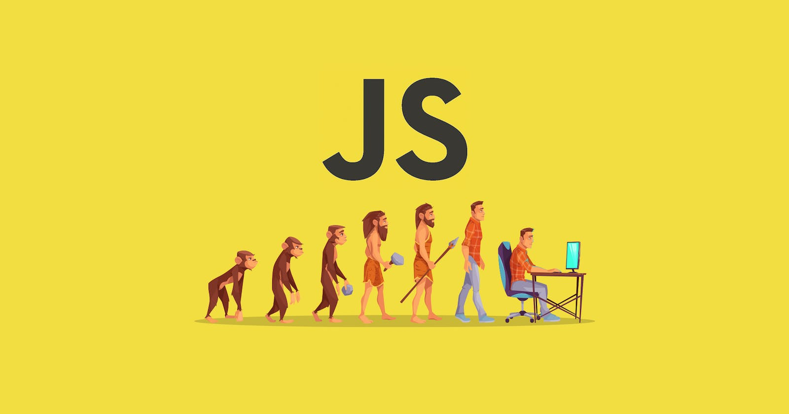

<p align="center">
  
</p>

#### - Front-End Developer and  Technology Lover
<div align="center">
<h1> My Skills ✌</h1>
    


</div>
<hr />

```js
const response = {
  status: 200,
  data: {
    fullName: "Abolfazl Sharifi",
    birthDay: "9 September",
    fieldOfStudy: "Information Technology (IT)",
    university: "Pardis Mashhad",
  }
};
```

<hr/>

<hr/>
